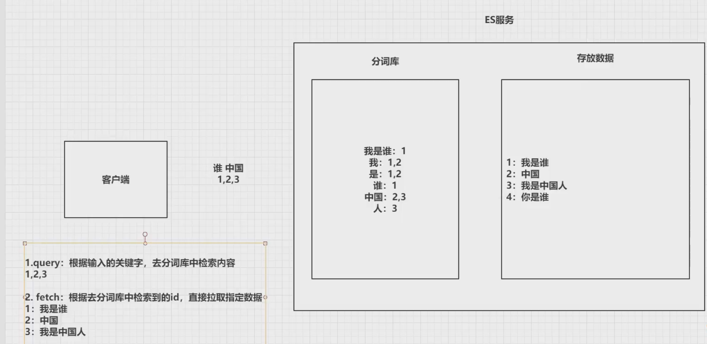
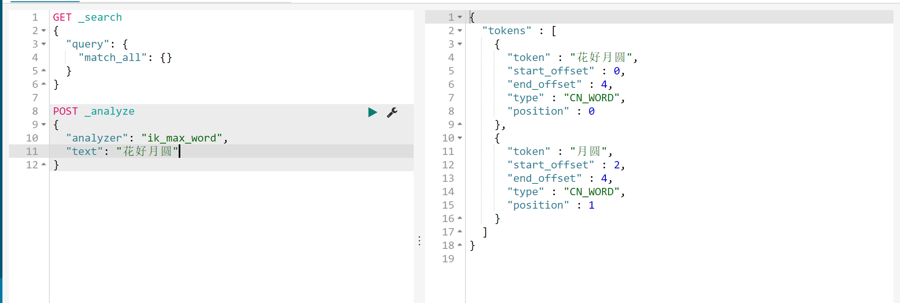
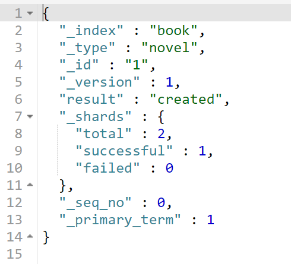
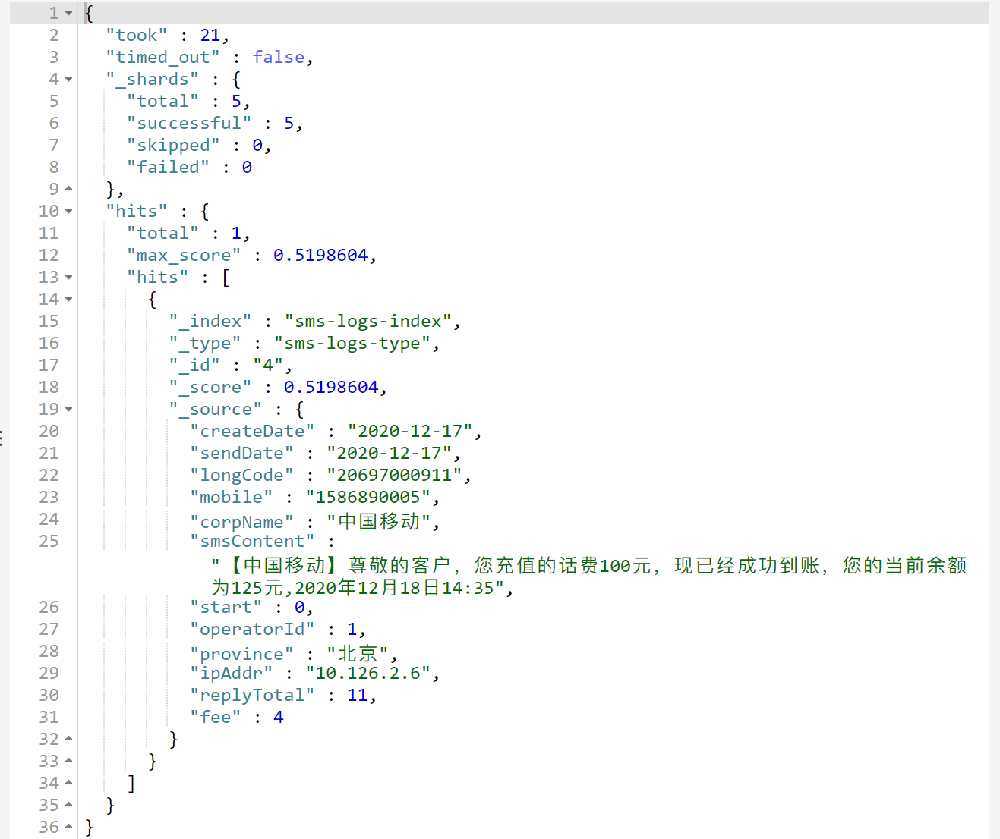
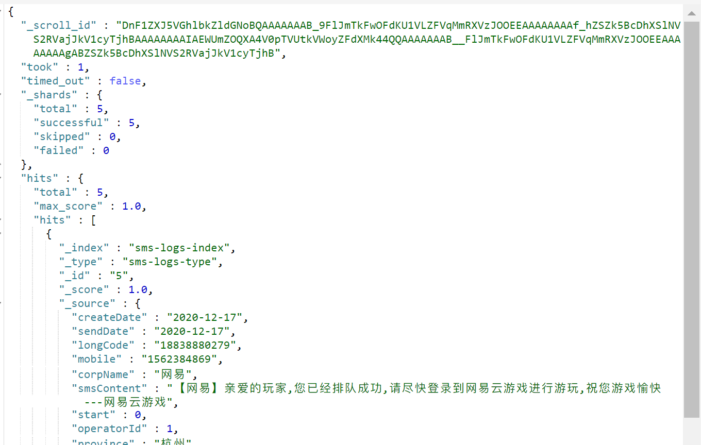

## 一 ElasticSearch

<font color=#FF0000>Elaticsearch</font>，简称为 es， es 是一个开源的高扩展的分布式全文检索引擎，它可以近乎实时的存储、检索数据；本身扩展性很好，可以扩展到上百台服务器，处理<font color=#FF0000>PB 级别(1PB=1024TB)</font>的数据。es 也使用 Java 开发并<font color=#FF0000>使用 Lucene 作为其核心</font>来实现所有索引和搜索的功能，但是它的目的是通过简单的<font color=#FF0000>RESTful API 来隐藏 Lucene 的复杂性</font>，从而让全文搜索变得简单。

Elaticsearch，有全文检索的功能（倒排索引）：把一句话分成各个词，查询的时候根据关键字找到相应的数据：



### 1 ElasticSearch 对比 Solr

|          | Solr                             | Elasticsearch                                |
| -------- | -------------------------------- | -------------------------------------------- |
| 管理方式 | 分布式管理,需要 zookeeper 的协助 | 自身带有分布式协调管理功能                   |
| 数据格式 | 支持更多格式的数据               | 仅支持 json 文件格式                         |
| 功能     | 功能更多                         | 更注重于核心功能，高级功能多有第三方插件提供 |
| 效果     | 不变数据效果好                   | 实时搜索更强                                 |

### 2 安装

#### 2.1 ES 安装/Kibana

Docker 安装

```bash
# docker 安装 elasticsearch 有效步骤
docker run --name elasticsearch-dev -p 19202:9200 -p 19102:9100 -it ubuntu

# 容器内
groupadd elasticsearch
useradd elasticsearch -g elasticsearch -p elasticsearch
mkdir /home/elasticsearch

# 容器外
docker cp .\elasticsearch-7.10.2-linux-x86_64.tar.gz esiu:/home/elasticsearch
docker cp .\elasticsearch.yml esiu:/home/elasticsearch/elasticsearch-7.11.2/config/
docker cp .\sysctl.conf esiu:/etc/
docker cp .\jvm.options esiu:/home/elasticsearch/elasticsearch-7.11.2/config/

# 启动 es
tar -xzvf elasticsearch-7.11.2-linux-x86_64.tar.gz
chown -R elasticsearch:elasticsearch /home/elasticsearch
runuser -l elasticsearch -c '/home/elasticsearch/elasticsearch-7.11.2/bin/elasticsearch'
```

#### 2.2 安装 IK 分词器

es 的检索对中文的支持不好，使用国内的 IK 分词器

```sh
#查看es的名称，可以看到是45开头的
docker ps
```


```sh
# 进入es，可以看到已经进入es目录中了
docker exec -it  名称的简写 bash
```


```sh
# 查看安装插件的命令是es-pigin
cd bin/
```


```sh
# 安装我们的KI分词器
# 下载路径为https://github.com/medcl/elasticsearch-analysis-ik/releases/download/v6.5.4/elasticsearch-analysis-ik-6.5.4.zip
./elasticsearch-plugin install github的下载路径
```

<font color=#FF0000>注意</font>：必须重启 es 这个 KI 分词器才会生效:

```sh
# 退出容器
exit
# 重启es
docker restact es的名称简写这里是45
# 访问192.168.10.106:9200查看是否重启成功
```

在 Kibana 中测试，可以看到成功的将词语分为几个



## 二 ES 结构

es 的存储结构与我们传统的数据库相差还是很大的：

### 1 索引 index

```markdown
# 1 ES 的服务中可以创建多个索引，

# 2 每个索引默认分成 5 片存储，

# 3 每一个至少有一个备份分片

# 4 备份分片正常不会帮助检索数据，除非 ES 的检索压力很大的情况发送

# 5 如果只有一台 ES，是不会有备份分片的，只有搭建集群才会产生
```


### 2 类型 type

```markdown
# 1 ES5.x 下，一个 index 可以创建多个 type

# 2 ES6.x 下，一个 index 只能创建一个 type

# 3 ES7.x 下，直接舍弃了 type，没有这玩意了
```


### 3 文档 doc

```markdown
# 一个 type 下可以有多个文档 doc，这个 doc 就类似 mysql 表中的行
```


### 4 属性 field

```markdown
# 一个 doc 下可以有多个属性 field，就类似于 mysql 的一列有多行数据
```


## 三 Restful 语法

```shell
# es 几种常见的请求方式，与我们的传统的 Restful 有区别

# get 请求（获取数据）

    http://ip:port/index    # 查询es的index
    http://ip:port/index/type/doc_id   # 根据文档id查询指定文档的信息

# post 请求

    http://ip:port/index/type/_search  # 查询文档，可以在请求体中添加json字符串的内容，代表查询条件
    http://ip:port/index/type/doc_id/_update # 修改文档 ，在请求体中指定json字符串，代表修改条件

# put 请求

    http://ip:port/index  # 创建索引,请求体中指定索引的信息
    http://ip:port/index/type_mappings # 创建索引，然后指定索引存储文档的属性

# delete 请求

    http://ip:port/index  # 删除索引
    http://ip:port/index/type/doc_id # 删除指定的文档
```

## 四 操作

### 1 索引的操作

```json
// 1 创建名为parson的索引
PUT /parson
{
  "settings": {
    "number_of_shards": 5,      // 默认分片为5
    "number_of_replicas": 1    // 默认备份为1
  }
}
```

```json
// 2 查看索引，可以通过图形界面，也可以通过发请求来查看，信息如下：
GET / parson
```


```json
// 3 删除索引,依然可以通过图形界面操作，然后这里请求删除会有这样的json返回，代表删除成功
DELETE / parson
```


### 2 field 的类型

就像是 mysql 的每列一样，int,string,data......，field 也需要指定相应的类型

```markdown
# 1 字符串类型

    text           # 最常用，一般用于全文检索，会给fleld分词
    keyword        # 不会给fleld进行分词

# 2 数值类型

    long
    integer
    short
    byte
    double
    float
    half_float      # 精度比float小一半，float是32位，这个是16位
    scaled_float    # 根据long类型的结果和你指定的secled来表达浮点类型：long:123 ,secled:100，结果：1.23

# 3 时间类型

    date         # 可以指定具体的格式  "format": "yyyy-MM-dd HH:mm:ss||yyyy-MM-dd||epoch_millis"

# 4 布尔类型

    boolean

# 5 二进制类型

    binary       # 基于base64的二进制

# 6 范围类型

    integer_range
    double_range
    long_range
    float_range
    data_range
    ip_range

# 7 经纬度类型

    geo_point   # 存储经纬度

# 8 ip 类型

    ip    # v4 v6都可以

# 9 ....
```

### 3 创建索引并指定结构

```json
PUT /boot
{
  "settings": {
    "number_of_shards": 5,      // 分片数
    "number_of_replicas": 1     // 分页数
  },
  "mappings": { // 指定数据结构
    "novel":{    // 指定索引类型为novel
      "properties":{  //文档存储的field
        "name":{          // 属性名
          "type": "text",   // 属性的类型
          "analyzer": "ik_max_word",  // 使用ik分词器
          "index": true,   // 当前field可以作为查询条件
          "store": false   // 是否需要额外的存储
        },
        "author":{
          "type": "keyword"
        },
        "count":{
          "type": "long"
        },
        "onSale":{
          "type": "date",
          "format": "yyyy-MM-dd HH:mm:ss||yyyy-MM-dd||epoch_millis"  // 三种格式都可以
        },
        "descr": {
          "type": "text",
          "analyzer": "ik_max_word"
        }
```

### 4 文档的操作

#### 1 添加文档

文档以<font color=#FF0000>\_index</font>,<font color=#FF0000>\_type</font>,<font color=#FF0000>\_id</font>，三个内容来确定唯一的一个文档

-   自动生成 id

```json
POST /book/novel
{
  "name": "三体",
  "author": "刘慈欣",
  "count": 100000,
  "on-sale": "2010-01-01",
  "descr": "嘻嘻嘻哈哈哈"
}
```

不过这样的 id 不好记，一般都是手动指定


-   手动指定 id

```json
PUT /book/novel/1   // 注意这里是PUT
{
  "name": "矛盾论",
  "author": "毛泽东",
  "count": 20000,
  "on-sale": "1935-01-01",
  "descr": "矛盾是什么等等"
}
```



#### 2 修改文档

-   覆盖式修改

```json
PUT /book/novel/1   // 也就是我们指定id添加的那个，如果重复执行会将老的覆盖
{
  "name": "矛盾论",
  "author": "毛泽东",
  "count": 20000,
  "on-sale": "1935-01-01",
  "descr": "矛盾是什么等等"
}
```

-   doc 修改

```json
POST /book/novel/szANLXYBuLPYwN8oa5RL/_update
{
  "doc": {   // 里面指定要修改的键值
    "name": "时间移民"
  }
}
```


#### 3 删除文档

```json
DELETE / book / novel / szANLXYBuLPYwN8oa5RL //根据索引类型id确定到doc然后删除
```

## 五 c# 操作 es

## 六 es 练习的准备数据

## 七 各种查询

### 1 term/terms 查询

#### 1.1 term 查询

> term 查询是完全匹配的，搜索之前不会对搜索的关键字进行分词，比如要搜河南省

```json
POST /sms-logs-index/sms-logs-type/_search
{
  "from": 0,   # 类似limit，指定查询第一页
  "size": 5,   # 指定一页查询几条
  "query": {
    "term": {
      "province": {
        "value": "上海"
```

可以看到查询结果，我们只要`_source`中的内容即可


#### 1.2 terms 查询

terms 查询，也是不会对条件进行分词，但是这个可以指定多条件，比如查询地点为上海的或者河南的

```json
POST /sms-logs-index/sms-logs-type/_search
{
  "query": {
    "terms": {
      "province": [
        "上海",
        "河南"
```


### 2 match 查询

> match 查询会根据不同的情况切换不同的策略
>
> -   如果查询 date 类型和数字，就会将查询的结果自动的转换为数字或者日期
> -   如果是不能被分词的内容(keyword)，就不会进行分词查询
> -   如果是 text 这种，就会根据分词的方式进行查询
>
> match 的底层就是多个 term 查询，加了条件判断等

#### 2.1 match_all 查询

会将全部的 doc 查询出来

```json
POST /sms-logs-index/sms-logs-type/_search
{
  "query": {
    "match_all": {}
  }
}
```

#### 2.2 match 查询

match 查询会针对不同的类型执行不同的策略

-   查询 text 类型的数据会对条件进行分词

```json
POST /sms-logs-index/sms-logs-type/_search
{
  "query": {
    "match": {
      "smsContent": "电话"
```

#### 2.3 布尔 match 查询

可以查询既包含条件 1，又包含条件 2 的内容，也就是 and 的效果，也可以实现 or 的效果

```json
POST /sms-logs-index/sms-logs-type/_search
{
  "query": {
    "match": {
      "smsContent": {
        "query": "电话 快递",
        "operator": "and"   # or
```

#### 2.4 multi_match 查询

> 针对多个 key 对应一个 value 进行查询, 比如下面就是查询地区带中国，或者内容带中国

```json
POST /sms-logs-index/sms-logs-type/_search
{
  "query": {
    "multi_match": {
      "query": "中国",
      "fields": ["province","smsContent"]
```

### 3 其他查询

#### 3.1 id 查询

```json
GET /sms-logs-index/sms-logs-type/1
```

```java
// id查询
@Test
public void idMatchQuery() throws IOException {
    // 使用getRequest
    GetRequest request = new GetRequest(index,type,"1");
    // 执行查询
    GetResponse response = client.get(request, RequestOptions.DEFAULT);
    // 输出结果
    Map<String, Object> result = response.getSourceAsMap();
    System.out.println(result);
}
```

#### 3.2 ids 查询

> 给以多个 id，查询多个结果，类似 mysql 的 where id in(1,2,3.....)

```java
# ids查询
POST /sms-logs-index/sms-logs-type/_search
{
  "query": {
    "ids": {
      "values": ["1","2","3"]
```

#### 3.3 prefix 查询

> 听名字就是前缀查询，查询子首的，可以指定指定字段的前缀，从而查询到指定的文档，可以实现类似百度输入后弹出提示的效果

```json
POST /sms-logs-index/sms-logs-type/_search
{
  "query": {
    "prefix": {
      "corpName": {
        "value": "滴滴"  # 这样就能搜到所有关于滴滴开头的公司名称了
```

#### 3.4 fuzzy 查询

> 模糊查询，根据输入的内容大概的搜索，可以输入错别字，不是很稳定，比如输入`网一`来搜索`网易`就搜不到

```json
# fuzzy查询
POST /sms-logs-index/sms-logs-type/_search
{
  "query": {
    "fuzzy": {
      "corpName": {
        "value": "中国移不动",
         "prefix_length": 2  # 可选项，可以指定前几个字符是不能错的
```

这里搜索中国移不动，依然可以搜索到中国移动



#### 3.5 wildcard 查询

> 通配查询，和 mysql 的`like`是一个套路，可以在搜索的时候设置占位符，通配符等实现模糊匹配

```json
POST /sms-logs-index/sms-logs-type/_search
{
  "query": {
    "wildcard": {
      "corpName": {
        "value": "中国*" # *代表通配符,?代表占位符 ，比如:中国? 就是搜中国开头的三个字的内容
```

#### 3.6 range 查询

> 范围查询，只针对数值类型

这里的范围是`带等号`的，这里能查询到 fee 等于 5，或者 10 的,如果想要`<`或者`>`的效果可以看注释

```json
# range查询
POST /sms-logs-index/sms-logs-type/_search
{
  "query": {
    "range": {
      "fee": {
        "gte": 5,  #gt
        "lte": 10  #lt
```

这里的范围，指定字符串的 5 或者 int 类型的 5 都是可以的，es 会自动的进行转换

#### 3.7 regexp 查询

> 正则查询，通过编写的正则表达式匹配内容
>
> -   PS：prefix，fuzzy，wildcard，regexp，查询的效率相对比较低，要求效率高的时候，不要使用这个

```json
# regexp查询
POST /sms-logs-index/sms-logs-type/_search
{
  "query": {
    "regexp": {
      "mobile": "15[0-9]{8}" # 这里查询电话号码15开头的，后面的数字8位任意
```

### 4 深分页 scroll

> 针对 term 查询的 from 和 size 的大小有限制，from+size 的总和不能大于 1 万
>
> from+size 查询的步骤
>
> -   先进行分词，然后把词汇去分词库检索，得到文档的 id，然后去分片中把数据拿出来，然后根据 score 进行排序，然后根据 from 和 size`舍弃一部分`，最后将结果返回
>
> scroll+size 查询
>
> -   同样分词，通过分词库找到文档的 id，将文档的 id 存放唉 es 的上下文中(内存中)，第四步根据指定的 size 去 es 中拿指定数量的数据，拿完数据的 docId 会从上下文移除，如果需要下一页数据，会去 es 的上下文中找
>
> [scroll 也有缺点，不适合实时查询，因为是从内存中找以前查询的，拿到的数据不是最新的，这个查询适合做后台管理]()

```json
POST /sms-logs-index/sms-logs-type/_search?scroll=1m  # 这里指定在内存中保存的时间，1m就是1分钟
{
  "query": {
    "match_all": {}
  },
  "size": 2,
  "sort": [   # 这里指定排序规则
    {
      "fee": {
        "order": "desc"
      }
    }
  ]
}
```

可以看到`_scroll_id`


查询下一页的数据

```json
POST /_search/scroll
{
  "scroll_id":"这里写id", # 这里写上第一次查询的_scroll_id
  "scroll":"1m"   # 重新指定存在时间，否则直接从内存删除了
}
```

如果看完第二页不想看下去了，想直接删除掉内存中的数据：

```json
DELETE / _search / scroll / scroll的id
```

6.5 delete-by-query

> 根据 term,match 等查询方式删除大量的文档
>
> [如果是大量的删除，不推荐这个方式，太耗时了，因为是根据查询的 id 一个一个删除，而查询本身也很消耗性能，推荐新建一个 index，把保留的部分保留到新的 index]()

```json
POST /sms-logs-index/sms-logs-type/_delete_by_query   # 把查询出来的结果删除
{
  "query":{
    "range":{
      "fee":{
        "lt":4
```

### 6 复合查询

#### 6.1 bool 查询

> 将多个查询条件以一定的逻辑组合在一起
>
> -   must：表示 and 的意思，所有的条件都符合才能找到
> -   must_not：把满足条件的都去掉的结果
> -   should：表示 or 的意思

```json
# 查询省份是上海或者河南
# 运营商不是联通
# smsContent中包含中国和移动
# bool查询
```

```json
POST /sms-logs-index/sms-logs-type/_search
{
  "query": {
    "bool":{
      "should": [ # or
        {
          "term": {
            "province": {
              "value": "上海"
            }
          }
        },
        {
          "term": {
            "province": {
              "value": "河南"
            }
          }
        }
      ],
      "must_not": [ # 不包括
        {
          "term": {
            "operatorId": {
              "value": "2"
            }
          }
        }
      ],
      "must": [ # and
        {
          "match": {
            "smsContent": "中国"
          }
        },
        {
          "match": {
            "smsContent": "移动"
          }
        }
      ]
    }
  }
}
```

#### 6.2 boolsting

> 分数查询，查询的结果都是有匹配度一个分数，可以针对内容，让其分数大，或者小，达到排前，排后的效果
>
> -   `positive`： 只有匹配到 positive 的内容，才会放到结果集，也就是放查询条件的地方
> -   `negative`：如果匹配到的 positive 和 negative，就会降低文档的分数 source
> -   `negative_boost`：指定降低分数的系数，必须小于 1.0，比如：10 分 这个系数为 0.5 就会变为 5 分
>
> 关于分数的计算：
>
> -   关键字在文档出现的频次越高，分数越高
> -   文档的内容越短，分数越高
> -   搜索时候，指定的关键字会被分词，分词内容匹配分词库，匹配的个数越多，分数就越高

```json
# boosting查询
POST /sms-logs-index/sms-logs-type/_search
{
  "query": {
    "boosting": {
      "positive": {
        "match": {
          "smsContent": "亲爱的"
        }
      },
      "negative": {
        "match": {
          "smsContent": "网易"
        }
      },
      "negative_boost": 0.5
    }
  }
}
```

网易原来的分数是 1 左右，现在是 1.43


```java
// boostingQuery查询
@Test
public void boostingQuery() throws IOException {
    // SearchRequest
    SearchRequest request = new SearchRequest(index);
    request.types(type);
    // 指定查询条件
    SearchSourceBuilder builder = new SearchSourceBuilder();
    BoostingQueryBuilder boostingQueryBuilder = QueryBuilders.boostingQuery(
        QueryBuilders.matchQuery("smsContent", "亲爱的"),
        QueryBuilders.matchQuery("smsContent", "网易")
    ).negativeBoost(0.5f);
    builder.query(boostingQueryBuilder);
    request.source(builder);
    // client执行
    SearchResponse response = client.search(request, RequestOptions.DEFAULT);

    // 获取结果
    for (SearchHit hit : response.getHits().getHits()) {
        System.out.println(hit.getSourceAsMap());
    }
}
```

### 7 filter 查询

> 过滤器查询：根据条件去查询文档，不会计算分数，而且 filter 会对经常查询的内容进行缓存
>
> 前面的 query 查询：根据条件进行查询，计算分数，根据分数进行排序，不会进行缓存

```json
#filter查询
POST /sms-logs-index/sms-logs-type/_search
{
  "query": {
    "bool":{
      "filter": [  # 过滤器可以指定多个
        {
          "term":{
            "corpName": "中国移动"
            }
        },
        {
          "range":{
            "fee": {
              "lte": 5
            }
            }
        }
        ]
    }
  }
}

```

```java
// filterQuery查询
@Test
public void filterQuery() throws IOException {
    // SearchRequest
    SearchRequest request = new SearchRequest(index);
    request.types(type);
    // 指定查询条件
    SearchSourceBuilder builder = new SearchSourceBuilder();
    BoolQueryBuilder boolQuery = QueryBuilders.boolQuery();
    boolQuery.filter(QueryBuilders.termQuery("corpName","中国移动"));
    boolQuery.filter(QueryBuilders.rangeQuery("fee").lte(5));

    builder.query(boolQuery);
    request.source(builder);
    // client执行
    SearchResponse response = client.search(request, RequestOptions.DEFAULT);

    // 获取结果
    for (SearchHit hit : response.getHits().getHits()) {
        System.out.println(hit.getSourceAsMap());
    }
}
```

### 8 高亮查询

> 将用户输入的内容，以高亮的样式展示出来，查询的结果会附带在 hits 下面以单独的形式返回，不会影响查询的结果
>
> ES 提供了一个`hightlight`的属性，和`query`同级别，其属性如下：
>
> -   `fragment_size`：指定要展示多少内容，可以看到百度的内容后面有...还有很长，默认`100个`
> -   `pre_tags`：指定前缀标签 比如：<font color="red">就是红色
> -   `post_tags`：指定后缀标签：</font>
> -   `fields`：指定哪几个 field 以高亮形式返回

```json
# hight查询
POST /sms-logs-index/sms-logs-type/_search
{
  "query": {
    "match": {   # 查询
      "smsContent": "亲爱的"
    }
  },
  "highlight": {   # 高亮显示
    "fields": {
      "smsContent": {}  # 要高亮展示的内容
    },
    "pre_tags": "<font color=red>",
    "post_tags": "</font>",
    "fragment_size": 10
  }
}
```

```java
// highlightQuery查询
@Test
public void highlightQuery() throws IOException {
    // SearchRequest
    SearchRequest request = new SearchRequest(index);
    request.types(type);

    // 指定查询条件
    SearchSourceBuilder builder = new SearchSourceBuilder();
    builder.query(QueryBuilders.matchQuery("smsContent", "亲爱的"));
    // 高亮显示
    HighlightBuilder highlightBuilder = new HighlightBuilder();
    highlightBuilder.field("smsContent",10) // 只显示10个字
        .preTags("<font color='read'>").postTags("</font>");    // 红色展示

    builder.highlighter(highlightBuilder);
    request.source(builder);
    // client执行
    SearchResponse response = client.search(request, RequestOptions.DEFAULT);

    // 获取结果,拿高亮的内容
    for (SearchHit hit : response.getHits().getHits()) {
        System.out.println(hit.getHighlightFields());
    }
}
```

### 9 聚合查询

> 也就是类似 mysql 的 count，max，avg 等查询，但要更为强大

聚合查询有新的语法

```json
POST /index/type/_search
{
    "aggs":{
        "名字":{
            "agg_type":{
                "属性":"值"
            }
        }
    }
}
```

#### 9.1 去重计数查询

> 去掉重复的数据，然后算出总数，也就是`Cardinality`

```json
# 去重记数查询
POST /sms-logs-index/sms-logs-type/_search
{
  "aggs": {
    "agg": { # 这个名字任意，不过会影响查询结果的键
      "cardinality": {   # 去重查询
        "field": "province"
```

可以看到我命名的是`agg`，这里查询的键也是`agg`


```java
// 去重记数查询
@Test
public void cardinalityQuery() throws IOException {
    // SearchRequest
    SearchRequest request = new SearchRequest(index);
    request.types(type);

    // 指定查询条件
    SearchSourceBuilder builder = new SearchSourceBuilder();
    builder.aggregation(AggregationBuilders.cardinality("agg").field("province"));
    request.source(builder);
    // client执行
    SearchResponse response = client.search(request, RequestOptions.DEFAULT);

    // 获取结果,拿到总数,因为Aggregation是一个接口，我们需要向下转型，使用实现类的方法才能拿的value
    Cardinality agg = response.getAggregations().get("agg");
    long value = agg.getValue();
    System.out.println("省份总数为："+value);

    // 拿到查询的内容
    for (SearchHit hit : response.getHits().getHits()) {
        System.out.println(hit.getSourceAsMap());
    }
}
```

去除重复的省份，总共有四个，然后总共有 5 条数据


#### 9.2 范围统计

> 根据某个属性的范围，统计文档的个数，
>
> 针对不同的类型指定不同的方法，
>
> `数值`：range
>
> `时间`：date_range
>
> `ip`：ip_range

数值范围查询：

```json
# 范围统计查询，小于号是不带等号的
POST /sms-logs-index/sms-logs-type/_search
{
  "aggs": {
    "agg": {
      "range": {
        "field": "fee",
        "ranges": [
          {
            "to": 5  # 小于5
          },
          {
            "from": 6,  # 大于等于6，小于10
            "to": 10
          },
          {
            "from":10  # 大于等于10
          }
        ]
      }
    }
  }
}
```

时间范围查询

```json
# 时间范围统计查询
POST /sms-logs-index/sms-logs-type/_search
{
  "aggs": {
    "agg": {
      "date_range": {
        "field": "createDate",
        "format": "yyyy",   # 指定查询条件，这里是以年为条件
        "ranges": [
          {
            "to": "2000"  # 小于2000年
          },
          {
            "from": "2000"  # 大于等于2000年
          }
        ]
      }
    }
  }
}
```

ip 范围查询

```json
# ip范围统计查询
POST /sms-logs-index/sms-logs-type/_search
{
  "aggs": {
    "agg": {
      "ip_range": {
        "field": "ipAddr",
        "ranges": [
          {
            "from": "10.126.2.7",  # 查询这个范围的ip
            "to": "10.126.2.10"
          }
        ]
      }
    }
  }
}
```

---

java 代码

```java
// 范围统计查询
@Test
public void range() throws IOException {
    // SearchRequest
    SearchRequest request = new SearchRequest(index);
    request.types(type);

    // 指定查询条件
    SearchSourceBuilder builder = new SearchSourceBuilder();
    builder.aggregation(AggregationBuilders.range("agg").field("fee")
                        .addUnboundedTo(5)   // 指定范围
                        .addRange(5,10)
                        .addUnboundedFrom(10));

    request.source(builder);
    // client执行
    SearchResponse response = client.search(request, RequestOptions.DEFAULT);

    // 获取结果
    Range agg = response.getAggregations().get("agg");
    for (Range.Bucket bucket : agg.getBuckets()) {
        String key = bucket.getKeyAsString();
        Object from = bucket.getFrom();
        Object to = bucket.getTo();
        long docCount = bucket.getDocCount();
        System.out.println(String.format("key：%s，from：%s，to：%s，docCount：%s",key,from,to,docCount));
    }
}
```

#### 9.3 统计聚合查询

> 可以查询属性(`field`)的最大值，最小值，平均值，平方和.......

```json
POST /sms-logs-index/sms-logs-type/_search
{
  "aggs": {
    "agg": {
      "extended_stats": {
        "field": "fee"
      }
    }
  }
}
```

```java
// 聚合查询
@Test
public void extendedStats() throws IOException {
    // SearchRequest
    SearchRequest request = new SearchRequest(index);
    request.types(type);

    // 指定查询条件
    SearchSourceBuilder builder = new SearchSourceBuilder();
    builder.aggregation(AggregationBuilders.extendedStats("agg").field("fee"));

    request.source(builder);
    // client执行
    SearchResponse response = client.search(request, RequestOptions.DEFAULT);

    // 获取结果
    ExtendedStats agg = response.getAggregations().get("agg");
    double max = agg.getMax();
    double min = agg.getMin();

    System.out.println("fee的最大值为"+max);
    System.out.println("fee的最小值为"+min);
}
```

其余的详情访问官网非常全面

https://www.elastic.co/guide/en/elasticsearch/reference/6.5/getting-started.html

[sunnyday999/LearnElasticSearch](https://github.com/sunnyday999/LearnElasticSearch)